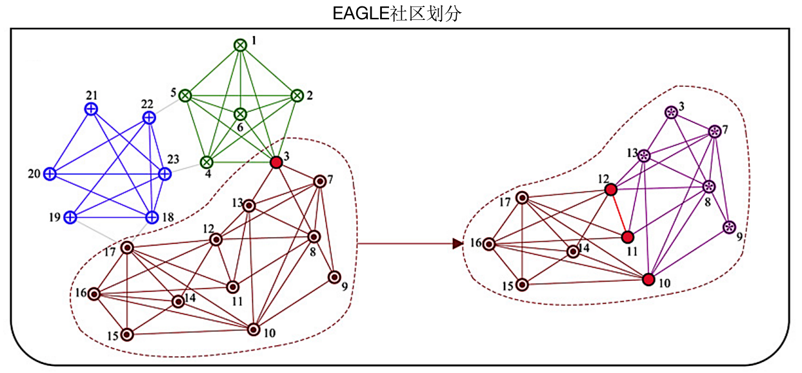
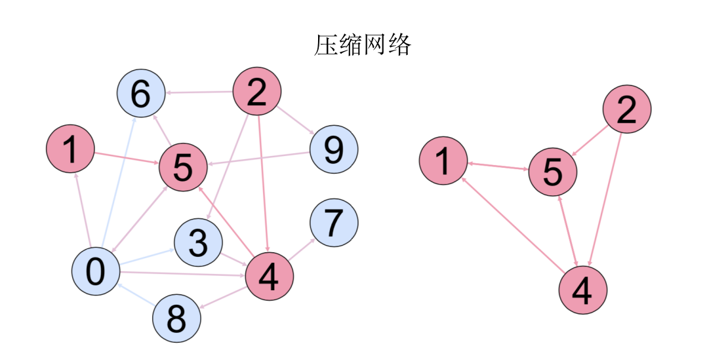
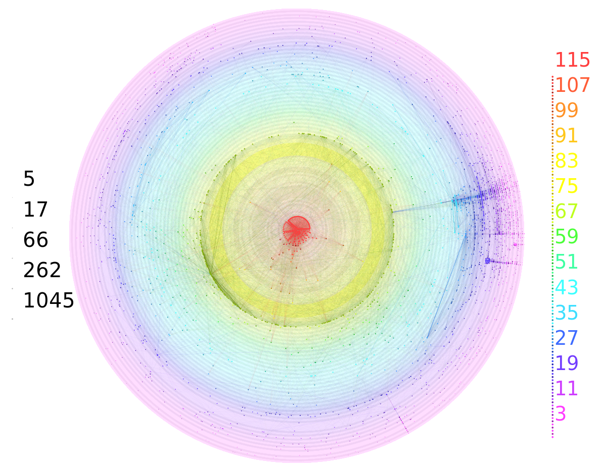

# 网络分析工具集

## 一、EAGEL社区划分(EAGLE)

### 1.1 配置文件说明

+ Vertex.txt分别是节点id，程序会自动将id映射为index。
+ Graph.txt是连边信息，第一行是节点个数，下面每一行按照`source target weight`的格式。source和target按照index书写。
+ run.sh是执行脚本，按照格式`./run.sh MinimumCliqueSize`执行。

### 1.2 结果文件说明

+ AllLeaf.txt文件是各社区的节点
+ SubNetwork文件夹内是中间结果
+ result文件夹是每个社区的详细信息：第一行为最大扩展模块度，下面每一行代表一个子社区。每个数字文件夹代表子社区再划分。

### 1.3 使用方法

	# step 1
	在EAGLE文件夹内，按照文件Graph.txt和Vertex.txt的格式配置自己的网络
	
	# step 2
	$ ./run.sh 5
	
	# step 3
	查看每个结果文件即可

## 二、动态网络可视化(Gephi_timeline)

### 2.1 配置文件说明

+ `vertex_*.txt`内有多行多列，每行一个节点，后面几列是节点的属性。
+ `graph_*.txt`内有多行多列，前两列是source和target，后面多列是边的属性。
+ 在`config.json`内指定节点和边的属性信息(可根据需要增加或减少属性)。
+ `gexf.py`和`Gene_timeline.py`将输入转为.gexf格式文件。

### 2.2 结果文件说明

+ 在`timeline文件夹`内会生成多个.gexf格式文件，其内容为xml格式用于Gephi的读取。

### 2.3 使用方法
	# step 1
	在Gephi\_timeline文件夹内，按照data文件夹下的Graph和Vertex格式放入数据。
	(graph\_xxx.txt，xxx可以是日期格式，比如20190101)
	
	# step 2
	$ ./run.sh
	
	# step 3
	将这些文件批量导入到Gephi软件，使用时间轴功能即可观察网络的动态变化
	

## 三、网络流(MaxFlow)

### 3.1 配置文件说明
+ 仿照`relations.txt`按照`source target weight`的格式配置自己的网络结构。
+ 在`VIC_list.txt`中配置重点关注的节点集(可以挑选重要客户网络或者其他子网络结构)。

### 3.2 结果文件说明
程序会根据配置自动生成Graph.txt、Vertex.txt和VIC.txt。

+ Vertex.txt是映射后的节点集。
+ Graph.txt是映射后的关系图。
+ VIC.txt是映射后的关注节点集。

+ 结果存储在`flow_res.txt`文件内。结果文件格式为`S->T`的最大流及经过的节点数。

### 3.3 使用方法

	# step 1
	修改relations.txt和VIC_list.txt配置文件
	
	# step 2
	$ ./run.sh
	
	# step 3
	将结果文件绘制成图可得到压缩网络

## 四、k-core分解可视化(Lanet-vi)

#### 运行环境： `CentOS 7.x + gcc 4.8 + blas + librsvg2`

### 4.1 文件说明

+ 输入数据按照`facebook_combined.txt`配置，每行是`source target`格式
+ `init_env.sh`是初始化运行环境
+ `run.sh`是执行脚本
+ 结果文件生成在result文件夹内，有两种格式：svg和png，png格式可直接查看效果，svg格式可用于查看更高分辨率。

### 4.2 使用方法

	# step 1
	首先运行ini_env.sh来初始化环境，本步骤只在首次执行需要
	
	# step 2
	按照`facebook_combined.txt`配置输入数据
	
	# step 3
	$ ./run.sh
	

## 五、网络指标(Metrics)

首先将`/home/zky/data/match`文件夹内的数据按照合约提取到`home/zky/Code/mydata/records`文件夹内，目标格式为`source target QTY trade_times time`，每个合约一个文件夹。
 
以及将`/home/zky/data/posi`文件夹内的数据按照合约提取到`home/zky/Code/mydata/posi`文件夹内，目标格式为`client_id QTY trade_times posi`，每个合约一个文件夹。

这一块比较依赖特定格式的交易数据，重点配置数据路径即可:

+ cal\_degree\_distribution.py 用来计算度分布，配置graph文件路径即可。
+ cal\_Network\_Statistics.py 用来计算网络密度、聚团系数等指标，配置graph\_files路径即可。
+ get\_k\_core.py 用来获取k-core的层数、各层客户。注意配置交易记录路径。
+ get\_weighted\_k\_core.py 用来获取weighted k-core的层数、各层客户。注意配置交易记录路径、客户信息表、客户类别表。
+ QTY\_heatmap.py 用来显示各类客户之间的交易量热力图。需要修改网络文件路径及HPBITSM_clients文件(每列一类客户)路径。
+ cal\_class\_profit.py 用来计算各类客户的盈亏。需要配置各类客户的持仓表路径和客户类别表。
